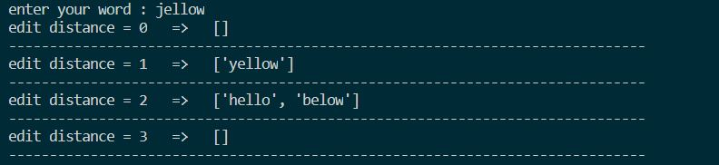

# edit_distance_algorithm
```diff
+ Edit Distance Algorithm
```
A project for getting similar words for our input word based on edit_distance algorithm.</br></br>
First of all you may use your beloved words inside the list.</br></br>
with getting your input word in console, this projects compare this word with the words inside the list based on edit_distance algorithm and returns the words in the list that have edit_distance values of 0,1,2,3 with input word.</br></br>
for example you entered word "hello" and the word you are comparing with is "yellow". because of "y" and "w" it has edit_distance value of 2 and the "yellow" word will be shwed in edit_distance_2 words.</br></br>

